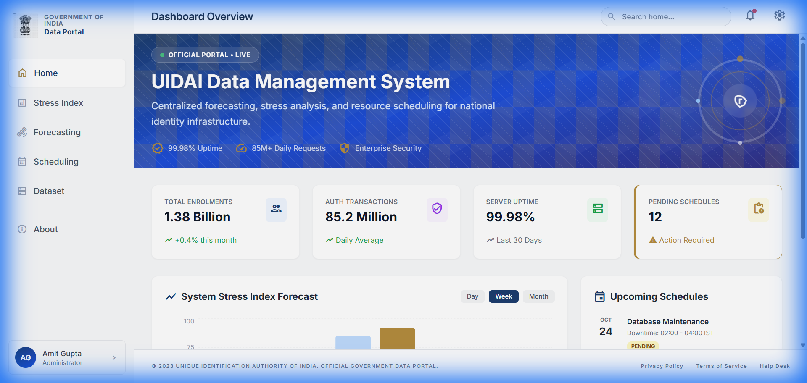
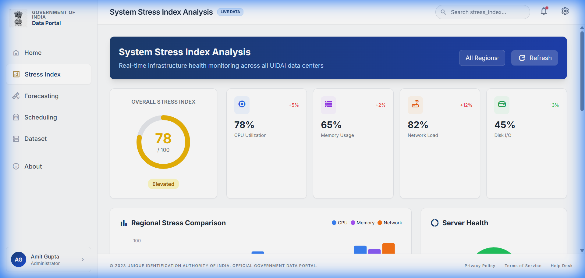
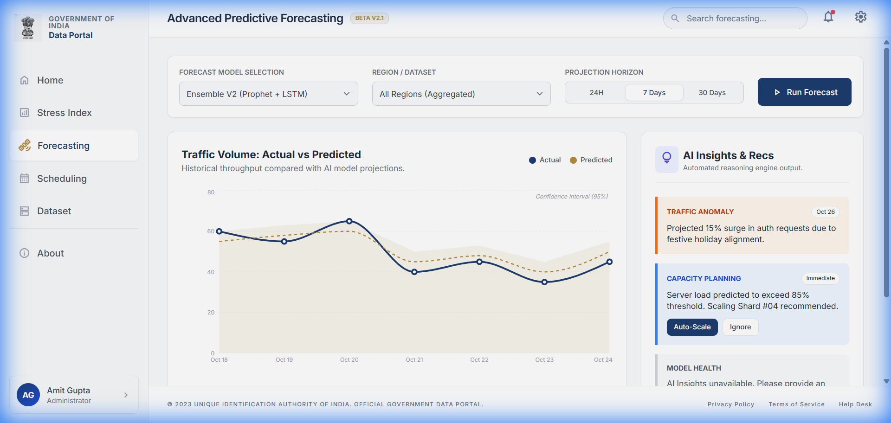
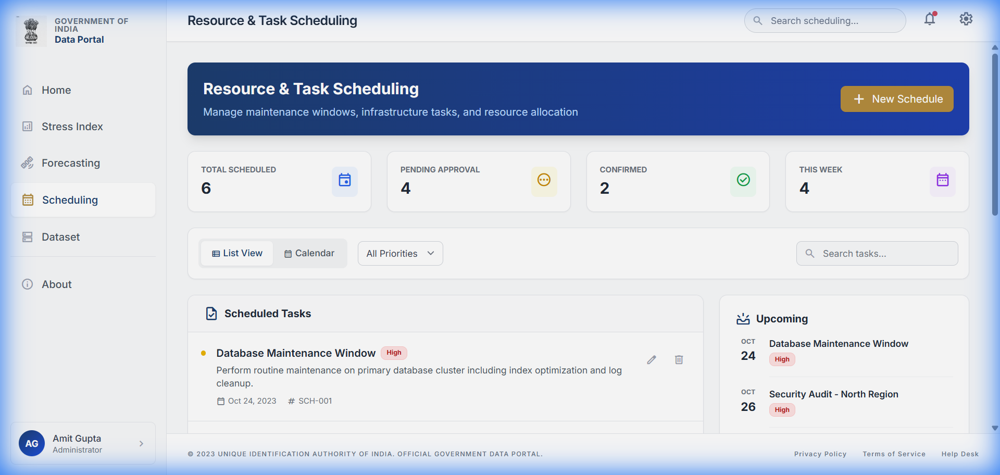
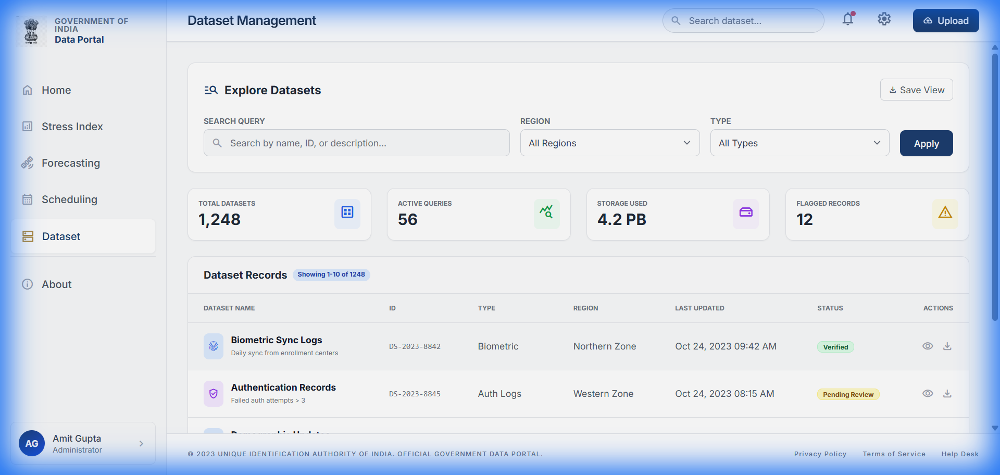
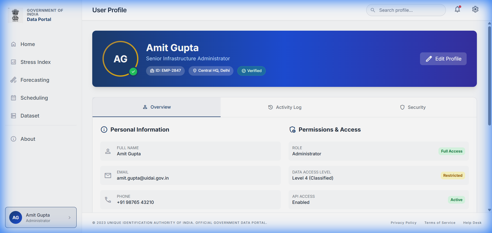
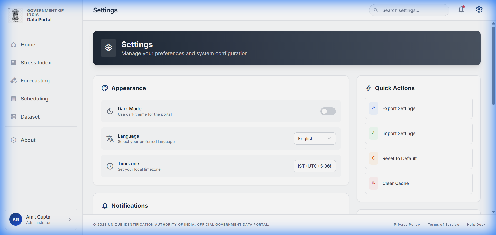

# UIDAI Data Management Portal

<div align="center">
  
  <h3>Government of India</h3>
  <p>Unique Identification Authority of India - Data Management System</p>
</div>

---

## 📋 Overview

The UIDAI Data Management Portal is a centralized platform for forecasting, stress analysis, and resource scheduling for India's national identity infrastructure (Aadhaar). This portal provides administrators with real-time insights into system health, predictive analytics, and operational management tools.

## 📸 Screenshots

### Dashboard


### Stress Index Analysis


### Advanced Forecasting


### Resource Scheduling


### Dataset Management


### User Profile


### Settings


---

## ✨ Features

### Dashboard
- **Key Metrics Display**: Total Enrolments (1.38 Billion), Auth Transactions, Server Uptime, Pending Schedules
- **Animated Header**: Dynamic geometric gradient background with live status indicator
- **System Stress Index Forecast**: Weekly visualization of infrastructure load
- **Upcoming Schedules**: Quick view of maintenance windows and events

### Stress Index Analysis
- **Real-time Monitoring**: Overall stress gauge with animated visualization
- **Component Metrics**: CPU, Memory, Network, and Disk I/O utilization
- **Regional Comparison**: Bar charts comparing stress across North, South, East, West, and Central zones
- **Server Health Distribution**: Pie chart showing Healthy/Warning/Critical servers
- **24-Hour Load Pattern**: Time-series visualization
- **Active Alerts**: Critical, warning, and info level alerts with acknowledgment

### Advanced Forecasting
- **AI-Powered Predictions**: Ensemble models (Prophet + LSTM)
- **Traffic Volume Charts**: Actual vs Predicted comparison
- **Confidence Intervals**: 95% prediction bands
- **AI Insights & Recommendations**: Gemini-powered automated reasoning

### Resource Scheduling
- **Task Management**: Create, edit, and track maintenance schedules
- **Priority Filtering**: High, Medium, Low priority classification
- **View Modes**: List and Calendar views
- **Resource Allocation**: Team utilization tracking
- **Quick Actions**: Schedule maintenance, request resources, generate reports

### Dataset Management
- **Search & Filter**: Query datasets by name, ID, type, or region
- **Dataset Records**: Biometric, Demographic, Auth Logs, System Logs
- **Status Tracking**: Verified, Pending Review, Action Required
- **Bulk Operations**: View, download, and manage dataset records

### User Profile
- **Personal Information**: User details, department, reporting structure
- **Permissions & Access**: Role-based access control, API access, audit logs
- **Activity Log**: Recent user actions and system interactions
- **Security Settings**: 2FA, login notifications, session timeout

### Settings
- **Appearance**: Dark mode toggle, language selection, timezone
- **Notifications**: Push notifications, email alerts, alert type preferences
- **Data & Display**: Auto-refresh, refresh interval, page size
- **Quick Actions**: Export/Import settings, reset to default, clear cache

## 🛠️ Tech Stack

- **Frontend**: React 19 + TypeScript
- **Build Tool**: Vite
- **Styling**: Tailwind CSS
- **Charts**: Recharts
- **AI Integration**: Google Gemini API
- **Icons**: Material Symbols

## 🚀 Getting Started

### Prerequisites
- Node.js (v18 or higher)
- npm or yarn

### Installation

1. **Clone the repository**
   ```bash
   git clone https://github.com/adi64/UIDAI_HACKATHON_26.git
   cd UIDAI_HACKATHON_26
   ```

2. **Install dependencies**
   ```bash
   npm install
   ```

3. **Configure environment variables**
   Create a `.env.local` file and add your Gemini API key:
   ```
   GEMINI_API_KEY=your_api_key_here
   ```

4. **Run the development server**
   ```bash
   npm run dev
   ```

5. **Open your browser**
   Navigate to `http://localhost:3000`

## 📁 Project Structure

```
UIDAI_HACKATHON_26/
├── components/
│   ├── Sidebar.tsx         # Navigation sidebar with emblem
│   └── StatCard.tsx        # Reusable statistics card
├── pages/
│   ├── Dashboard.tsx       # Home dashboard with metrics
│   ├── StressIndex.tsx     # System stress analysis
│   ├── Forecasting.tsx     # AI-powered predictions
│   ├── Scheduling.tsx      # Task scheduling
│   ├── Dataset.tsx         # Data management
│   ├── Profile.tsx         # User profile
│   ├── Settings.tsx        # System settings
│   └── About.tsx           # About page
├── services/
│   └── geminiService.ts    # Gemini AI integration
├── screenshots/            # README screenshots
├── public/
│   └── emblem.png          # National Emblem
├── App.tsx                 # Main app component
├── index.tsx               # Entry point
├── types.ts                # TypeScript types
└── index.html              # HTML template
```

## 🔐 Security

- Multi-layer encryption
- Role-based access control
- Audit trail logging
- Compliance with government security standards

## 📊 System Statistics

| Metric | Value |
|--------|-------|
| Total Enrolments | 1.38 Billion |
| Daily Auth Requests | 85+ Million |
| System Uptime | 99.98% |
| Data Managed | 4.2 PB |

## 📄 License

This project is developed for the UIDAI Hackathon 2026.

## 🤝 Contact

- **Email**: support@uidai.gov.in
- **Helpline**: 1947 (Toll Free)
- **Website**: [https://uidai.gov.in](https://uidai.gov.in)

---

<div align="center">
  <p>© 2026 Unique Identification Authority of India. All rights reserved.</p>
</div>
